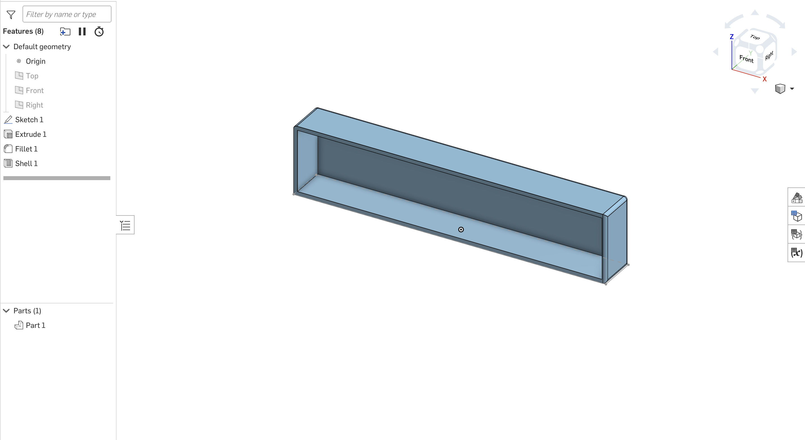
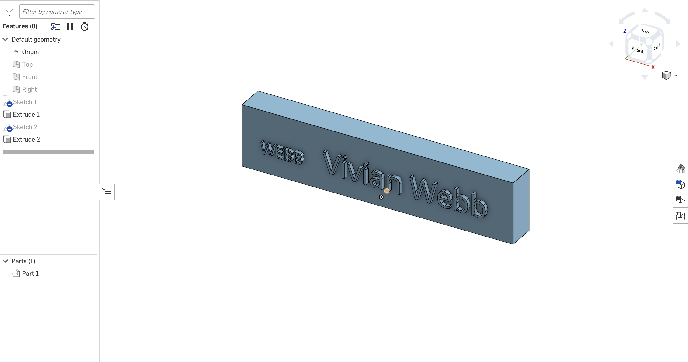

# Project PNP

**Learning how to use Onshape**

This project was my first time trying 3D modelling, so this was the opportunity for me to learn about the basic skills on Onshape. These are some of the designs that I made while learning how to use this tool.

I designed this so that the box wtih different designs can be replaced for customisation. I learned how to create shapes, write letters, extrude the shapes/letters, and scale the elements.

**Making plate prototype with laser cutters**

With the laser cutter team, I made prototypes of the plate part for the decided designs. 

This process helped me learn about the pros and cons of the laser cutter, and how to choose tools based on suitability for the project.

